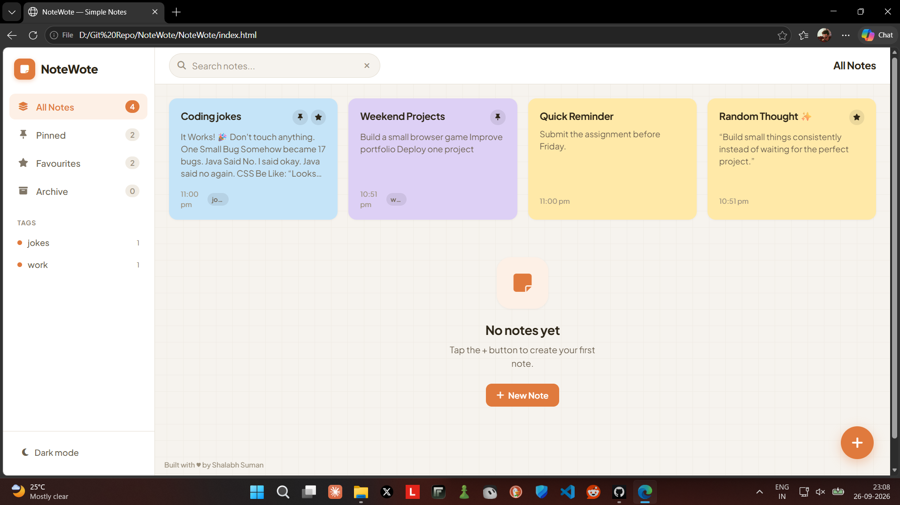
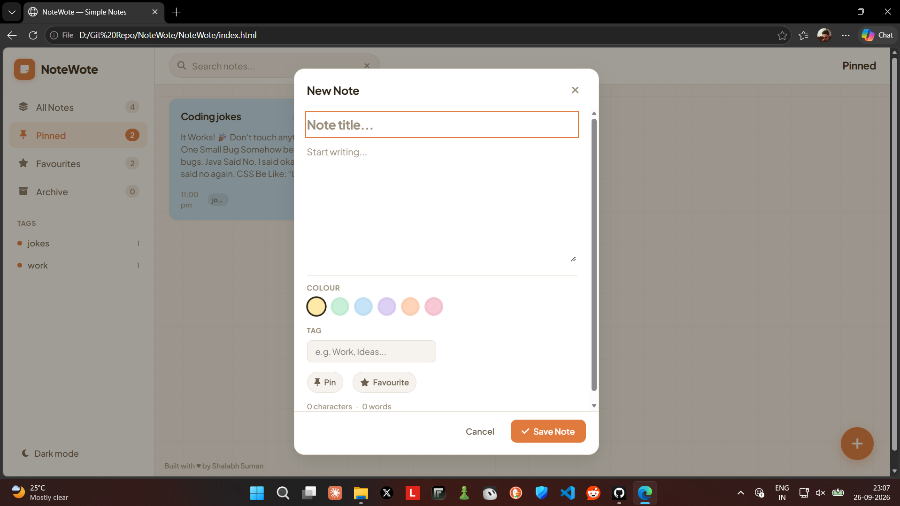

# 📝 NoteWote

**NoteWote** is a simple, colourful and lightweight notes app built with **HTML, CSS and Vanilla JavaScript**. It is designed to make everyday note-taking quick, organized and enjoyable without unnecessary complexity.

## 👀 Preview

### Dashboard






## ✨ Features

* 📝 Create, edit and delete notes
* 🔍 Search notes instantly
* 📌 Pin important notes
* ⭐ Favourite notes
* 🗂️ Organize notes with tags
* 🎨 Colourful note cards
* 🌙 Dark & light mode
* 📖 Distraction-free Focus Mode
* 🔢 Word & character count
* 💾 LocalStorage for persistent notes
* 📱 Fully responsive across devices
* ✨ Smooth and friendly UI interactions

## 🌟 Standout Feature

### Focus Mode 📖

Focus Mode turns any note into a clean, distraction-free writing space. It removes unnecessary distractions and lets you concentrate on the content you're writing.


## 🛠️ Built With

* **HTML5** — Structure
* **CSS3** — Styling & responsive design
* **JavaScript** — Functionality
* **LocalStorage** — Data persistence
* **Google Fonts & Font Awesome** — Typography & icons

## 🚀 Getting Started

Clone the repository:

```bash
git clone https://github.com/yourusername/notewote.git
```

Then open `index.html` in your browser.

No framework, backend or installation required.

## 📱 Responsive Design

NoteWote is designed to work smoothly on **desktop, tablet and mobile devices**, with touch-friendly controls and layouts that adapt to different screen sizes.

## 📌 Project Goal

The goal of NoteWote was to build a notes application that stays **simple, useful and visually enjoyable**, while practicing real frontend concepts such as CRUD operations, LocalStorage, DOM manipulation, search, filtering and responsive UI design.

---

### 👨‍💻 Developed by Shalabh Suman

**© 2026 NoteWote**
